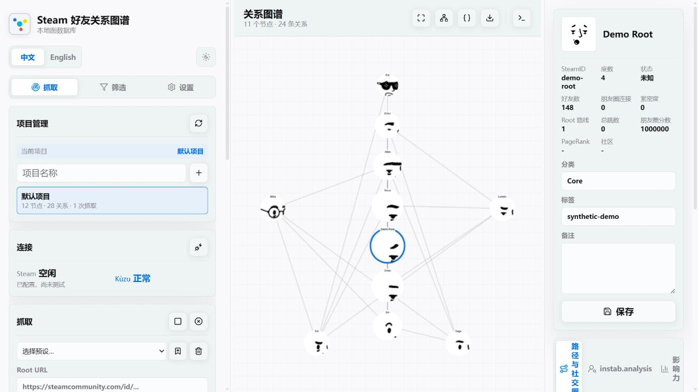

# Steam Friend Relationship Map (Web)

[中文](../README.md) | [English](README_EN.md)

[](https://github.com/CZL-Homelab/Steam-Friend-Relationship-Map/releases)
[](https://github.com/CZL-Homelab/Steam-Friend-Relationship-Map/actions/workflows/quality.yml)
[](https://github.com/CZL-Homelab/Steam-Friend-Relationship-Map/actions/workflows/quality.yml)
[](../LICENSE)
[](../pyproject.toml)

## Table of Contents

- [Fully Anonymized Demo](#fully-anonymized-demo)
- [What does this tool do?](#what-does-this-tool-do)
- [What you need to prepare](#what-you-need-to-prepare)
- [Is Neo4j Desktop still needed?](#is-neo4j-desktop-still-needed)
- [Architecture](#architecture)
- [Security reminder: what not to commit](#security-reminder-what-not-to-commit)
- [Branch Workflow](#branch-workflow)
- [Contributing](#contributing)
- [AI Generation Statement](#ai-generation-statement)
- [Disclaimer & sensitive data notice](#disclaimer--sensitive-data-notice)
- [Web-based security configuration](#web-based-security-configuration)
- [Installation from scratch](#installation-from-scratch)
  - [Step 1: Verify uv](#step-1-verify-uv)
  - [Step 2: Open project directory](#step-2-open-project-directory)
  - [Step 3: Create .env configuration](#step-3-create-env-configuration)
  - [Step 4: Get Steam Web API Key](#step-4-get-steam-web-api-key)
  - [Step 5: Get ready to enter Steam API Key](#step-5-get-ready-to-enter-steam-api-key)
  - [Step 6: Prepare Neo4j Desktop](#step-6-prepare-neo4j-desktop)
  - [Step 7: Fill in Neo4j connection info](#step-7-fill-in-neo4j-connection-info)
  - [Step 8: Review the complete .env](#step-8-review-the-complete-env)
  - [Step 9: Install dependencies](#step-9-install-dependencies)
  - [Step 10: Start the app](#step-10-start-the-app)
- [First-run checklist](#first-run-checklist)
- [Your first friend graph crawl](#your-first-friend-graph-crawl)
  - [How to use pre-scan filters?](#how-to-use-pre-scan-filters)
  - [Post-scan filters, sorting & friend circle analysis](#post-scan-filters-sorting--friend-circle-analysis)
  - [Logs and security troubleshooting](#logs-and-security-troubleshooting)
- [Viewing the graph in Neo4j Bloom](#viewing-the-graph-in-neo4j-bloom)
- [FAQ](#faq)

---

This is a **local-first, privacy-conscious open-source social graph analysis project**, with Steam as its current data source. Enter a public Steam profile URL as the root to crawl 1–4 layers of public friend relationships into local Kùzu (default, zero-install) or optional Neo4j storage, then explore paths and graph analytics in the local Web GUI.

Local-first means the application, graph database, credentials, notes, and analysis stay under the user's control by default. The project does not provide an author-hosted cloud service or built-in telemetry.

## Fully Anonymized Demo



This screenshot was produced from an isolated temporary Kuzu database with fictional names, `demo-*` identifiers, and generated placeholder avatars. It contains no real Steam account, SteamID, relationship, credential, database path, or personal note.

## What does this tool do?

It's designed for local organization and exploration of Steam friend networks:

- Automatically crawl public friend lists starting from one Steam profile.
- Generate relationship graphs automatically — no manual drawing needed.
- Each node shows avatar, nickname, Steam profile, notes, tags, and category.
- Find the shortest relationship path between two people.
- View in this project's GUI, or use Kùzu Explorer or Neo4j Bloom for more advanced large-graph analysis.

This project only uses the public Steam Web API. It does not read cookies, use Steam login, or attempt to bypass privacy settings.

## What you need to prepare

| Item              | Purpose                                                                          |
| ----------------- | -------------------------------------------------------------------------------- |
| Steam account     | To request a Steam Web API Key                                                   |
| Steam Web API Key | To call the public Steam Web API; save via the web UI to system credential store |
| Kùzu Embedded DB (Default) | **Zero installation required**, runs in-process via Python, stores data in `./data/graph_kuzu` |
| Neo4j Desktop (Optional) | To run the local graph database and explore with Neo4j Bloom |
| uv                | To manage Python environment and dependencies                                    |
| Python 3.12+      | Runtime environment (handled automatically by `uv`)                              |

Recommend starting with 1 or 2 layers. Steam friend networks grow exponentially — 3–4 layers can quickly approach or exceed node limits.

## Database Selection: Kùzu vs Neo4j?

This project features a **dual-engine graph database architecture**, supporting the embedded Kùzu database by default, while allowing optional configuration of external Neo4j.

- **Kùzu Embedded Database (Default)**:
  - **Advantage**: **Zero database installation required**, ready to use out-of-the-box. It runs as a Python package in the same application process, keeping memory and disk footprints extremely low. Data is saved locally in the `./data/graph_kuzu` directory.
  - **Visualization**: View, search, and query paths in the included Web GUI. If you need low-level Cypher debugging, you can spin up the `kuzu-explorer` Docker container (see details below).
- **Neo4j Desktop (Optional)**:
  - **Advantage**: Supports Neo4j Bloom and other professional graph visualization tools/algorithms, suitable for larger-scale network analysis.
  - **Setup**: The project's Web GUI handles crawling and daily operations, while Neo4j Desktop runs the local database and supports Neo4j Bloom exploration.

You can modify the configuration in `.env` to switch between these engines. For quick start, we recommend the default Kùzu database.

## Architecture

```text
       Steam Web API
             ↓
     FastAPI + BFS Crawler
       /             \
  (Default)       (Optional)
 Kùzu Engine     Neo4j Engine
 (Local file)   (External DB)
       \             /
              ↓
     This project's Web GUI (Cytoscape.js)
              ↓
  (Optional) Neo4j Bloom / Kùzu Explorer
```

Core capabilities:

- Supports Steam `/profiles/<steamid>` and `/id/<vanity>` profile URLs.
- Uses public Steam Web API; does not read cookies or bypass privacy settings.
- Crawl depth limited to 1–4 layers; max user count 10000.
- Automatically creates `SteamUser` nodes and `STEAM_FRIEND` relationships.
- Isolates projects with explicit `IN_PROJECT` memberships; the same Steam user can safely belong to multiple projects, and deleting one project preserves users still referenced elsewhere.
- Automatically performs a one-time idempotent membership migration for legacy databases that only stored `project_id` properties.
- GUI supports Chinese / English language switching.
- Avatar cards, notes, tags, categories, central node rankings, and shortest path queries.

## Security reminder: what not to commit

If this repo is public, never commit:

- `.env`
- Steam Web API Key
- Neo4j username and password
- Neo4j database dumps, backups, `.db`, or SQLite files
- Exported real CSV/JSON graph data
- Screenshots containing private notes, friend paths, SteamIDs, avatars, or nicknames
- Any cookies, login states, passwords, access tokens, or browser session data

`.env` is already ignored by `.gitignore`, but if you manually copy keys into README, Issues, screenshots, or other files, Git may still track them.

## Branch Workflow

This repo uses a tiered branching model. All feature development passes through security review before merging to `main`:

```
dev-N (feature development)
   ↓  PR / merge
dev-base (integration branch)
   ↓  security audit + cleanup
security-check-before-main
   ↓  final review (by a different person)
main (production)
```

| Branch                       | Purpose                               | Who can merge                        |
| ---------------------------- | ------------------------------------- | ------------------------------------ |
| `dev-N`                      | Feature branches (N=1,2,3...)         | Developer                            |
| `dev-base`                   | Integration branch for all dev-N      | Developer                            |
| `security-check-before-main` | Security audit + fixes + code cleanup | Security auditor                     |
| `main`                       | Production                            | **Must be reviewed by someone else** |

### Development workflow

1. Create feature branch `dev-N` from `dev-base`
2. After development, PR to `dev-base`
3. When `dev-base` has enough features, create `security-check-before-main` from `dev-base`
4. On `security-check-before-main`, perform:
   - Security audit (see `SECURITY.md` audit report format)
   - Fix any security issues found
   - Normalize code comments and formatting
   - Update audit report in `SECURITY.md`
5. Submit `security-check-before-main` for **someone else** to review before merging to `main`

### Commit conventions

- **Title**: Bilingual, Chinese first. Format: `feat/fix/chore: Chinese / English`
- **Body**: One paragraph each in Chinese and English, listing key changes

## Contributing

Issues, documentation, tests, bug fixes, and well-scoped feature pull requests are welcome. See [CONTRIBUTING.md](../CONTRIBUTING.md) for development setup, branching, quality gates, review expectations, and release management. Do not report vulnerabilities in public issues; follow [SECURITY.md](../SECURITY.md). See [PRIVACY.md](../PRIVACY.md) for data-handling expectations.

## AI Generation Statement

> **This project uses AI-assisted implementation with human-directed architecture, validation, and maintenance.**
>
> A substantial portion of the code, documentation, and configuration was generated with assistance from AI tools including **GPT 5.5 Vibe Coding**. The maintainer is responsible for requirements and architecture decisions, task decomposition, integration, debugging, testing, security gates, and release decisions. AI output is not treated as inherently correct.
>
> - AI-assisted changes must still pass automated tests, static analysis, dependency and secret checks, and human review through the documented branch workflow.
> - AI can produce hallucinations, redundancy, or implementations that miss best practices; issues and pull requests are welcome.
> - AI contributors must first follow [`.agents/.cursorrules`](../.agents/.cursorrules), [CONTRIBUTING.md](../CONTRIBUTING.md), [SECURITY.md](../SECURITY.md), and [PRIVACY.md](../PRIVACY.md).
>
> This disclosure provides implementation transparency; it does not replace maintainer responsibility for integration, validation, security response, and release management.

## Disclaimer & sensitive data notice

This is an unofficial local Steam friend relationship mapping tool, intended solely for personal learning, research, and local visualization. This project has no affiliation, partnership, authorization, endorsement, or official connection with Valve, Steam, or Neo4j.

This project only uses data accessible through the public Steam Web API. It does not read cookies, store Steam passwords, or attempt to bypass privacy settings. Due to Steam user privacy settings, API limits, network conditions, and API changes, crawl results may be incomplete, inaccurate, or may stop working at any time.

Do not use this project for harassment, doxxing, unauthorized surveillance, spam, privacy violations, or any illegal or abusive purposes. Users are responsible for ensuring their use complies with the [Steam Web API Terms of Use](https://steamcommunity.com/dev/apiterms), the Steam Subscriber Agreement, local laws and regulations, and the privacy rights of relevant individuals.

`.env`, Steam API Keys, Neo4j passwords, database backups, export files, screenshots, and manual notes may contain sensitive information. Before publishing a repo, submitting Issues, sharing screenshots, or releasing datasets, remove keys, passwords, private notes, and identifiable relationship data.

This is not legal advice. Whether certain data may be crawled, stored, analyzed, or publicly shared must be determined by the user based on their specific use case, and the user assumes all responsibility.

## Web-based security configuration

The current version recommends entering the Steam API Key, Steam proxy URL, and Neo4j password through the web UI. After saving, they are written to the system credential store (e.g., Windows Credential Manager) rather than `.env`.

Security measures:

- Frontend input uses password-type fields.
- Input fields are cleared after saving.
- The API only returns "configured / not configured" — the actual key, proxy URL, or password is never echoed back.
- Steam proxies support `http://`, `https://`, `socks5://`, and `socks5h://`. Proxy URLs containing credentials are stored in the system credential store and included in log redaction.
- `.env` should only contain non-sensitive config like Neo4j URI, username, port, and default crawl parameters.
- `STEAM_PROXY_URL` remains available as an `.env` fallback; migrate it to the web UI when the URL contains credentials.
- Legacy `.env` entries for `STEAM_API_KEY` and `NEO4J_PASSWORD` are still read for compatibility, but the UI suggests migrating to secure storage.
- If you need real transport-layer encryption, enable local HTTPS; plain localhost HTTP should not be described as "end-to-end encrypted".

## Installation from scratch

Follow the steps in order. Do not skip — especially creating `.env` first.

### Step 1: Verify uv

In PowerShell:

```powershell
uv --version
```

If a version number appears, `uv` is ready. If not, install `uv` first. Project dependencies, virtual environment, and launch commands are all managed through `uv`.

### Step 2: Open project directory

```powershell
cd Steam-Friend-Relationship-Map
```

Adjust the path to your actual project location.

### Step 3: Initialize .env configuration

To run the project properly, you need to create a `.env` configuration file. The project now supports **interactive automatic initialization**:

1. **Auto-Guided Setup**: Simply start the project in your terminal:
   ```bash
   uv run steam-friend-map
   ```
   If the system detects that the `.env` file is missing, it will automatically guide you in the console to enter the local port (e.g. `8000`) for the Web UI. Once finished, it automatically generates the `.env` config file based on `.env.example`.

2. **Explicit Initialization/Re-configuration**: If you want to reconfigure or explicitly run the initialization, use the `--init` option:
   ```bash
   uv run steam-friend-map --init
   ```

3. **Manual Copy (Fallback)**: You can still manually copy the template as before:
   - Windows (PowerShell):
     ```powershell
     Copy-Item .env.example .env
     ```
   - Linux/macOS:
     ```bash
     cp .env.example .env
     ```
   The newly generated `.env` will look similar to this, where you can configure the Web UI local port by changing `APP_PORT`:
   ```env
   APP_PORT=8000
   ```

It is not recommended to include sensitive credentials like Steam API Key or Neo4j password in this configuration file. Instead, fill them in the "Secure Settings" area in the web UI after launching, where they will be saved securely.

### Step 4: Get Steam Web API Key

The Steam Web API Key is required to access the public Steam API. Without it, friend lists and profiles cannot be fetched.

How to get one:

1. Log into your Steam account.
2. Open the Steam Web API Key page:

   ```text
   https://steamcommunity.com/dev/apikey
   ```

3. If asked for a Domain Name, enter:

   ```text
   localhost
   ```

   This project runs locally and does not need a real public server. You can also use your own domain.

4. Read and agree to the Steam API Terms of Use.
5. After submitting, the page displays an API Key.
6. Copy this key and paste it into the web UI "Secure Settings" later.

Notes:

- The Steam Web API Key is sensitive — do not commit it to GitHub.
- Do not post the key in Issues, screenshots, README, chat logs, or public documents.
- If the key is leaked, go back to the Steam API Key page to revoke or regenerate it.
- Steam official docs: using the Steam Web API requires an API Key and agreement to the Steam API Terms of Use: `https://steamcommunity.com/dev`.

### Step 5: Get ready to enter Steam API Key

Keep the key from Step 4 in a safe temporary place. You'll enter it in the web UI's "Secure Settings" section. Do not write the real key into README or commit it to Git.

If you previously wrote it into `.env` using the old method, the project still reads it for compatibility, but migration to web-based secure storage is recommended.
### Step 6: Prepare Neo4j Desktop (Skip Steps 6 and 7 if using the default Kùzu engine)

1. Open Neo4j Desktop.
2. Create a Project, or use an existing one.
3. Create a local DBMS within the Project.
4. Set a database password and remember it.
5. Click Start to launch the database.
6. Confirm the database is in Running state.

Default Bolt address is usually:

```text
bolt://localhost:7687
```

Default username is usually:

```text
neo4j
```

This tool connects to Neo4j Desktop via Bolt and writes Steam users and friend relationships into it.

### Step 7: Fill in Neo4j connection info (Skip Steps 6 and 7 if using the default Kùzu engine)

Edit `.env`:

```env
NEO4J_URI=bolt://localhost:7687
NEO4J_USER=neo4j
```

If you changed the Bolt port or username in Neo4j Desktop, use your actual values. The Neo4j password is entered later in the web UI "Secure Settings" and saved to the system credential store.

### Step 8: Review the complete .env

The final `.env` configuration file will differ depending on your choice of database engine.

#### Option A: Using Kùzu Embedded Database (Default & Recommended, Zero-Install)

If you use Kùzu as the graph database, your `.env` should look like this:

```env
GRAPH_DB_ENGINE=kuzu
KUZU_DB_PATH=./data/graph_kuzu         # Local data storage directory
KUZU_BUFFER_POOL_SIZE_GB=1             # Max memory buffer pool size for Kùzu
APP_HOST=127.0.0.1
APP_PORT=8000
DEFAULT_MAX_DEPTH=1
DEFAULT_MAX_NODES=200
DEFAULT_DELAY_MS=500
```

#### Option B: Using Neo4j Desktop Database (Optional)

If you use Neo4j as the graph database, your `.env` should look like this:

```env
GRAPH_DB_ENGINE=neo4j
NEO4J_URI=bolt://localhost:7687
NEO4J_USER=neo4j
APP_HOST=127.0.0.1
APP_PORT=8000
DEFAULT_MAX_DEPTH=1
DEFAULT_MAX_NODES=200
DEFAULT_DELAY_MS=500
```

Details for each setting:

| Setting | Meaning |
| :--- | :--- |
| `GRAPH_DB_ENGINE` | Active graph database engine type; `kuzu` or `neo4j` |
| `KUZU_DB_PATH` | Local file path for Kùzu database storage |
| `KUZU_BUFFER_POOL_SIZE_GB` | The maximum physical memory buffer pool size (in GB) allocated to Kùzu |
| `NEO4J_URI` | Neo4j Bolt connection address |
| `NEO4J_USER` | Neo4j username, usually `neo4j` |
| `APP_HOST` | Local server listen address, default `127.0.0.1` |
| `APP_PORT` | Local server port, default `8000` |
| `DEFAULT_MAX_DEPTH` | Default crawl depth; start with `1` or `2` |
| `DEFAULT_MAX_NODES` | Default maximum node count |
| `DEFAULT_DELAY_MS`  | Steam API request interval in milliseconds |

Steam API Key and Neo4j password are not in this file — they are sensitive and should be saved via the web UI to the system credential store.

### Step 9: Install dependencies

In the project directory:

```powershell
uv sync
```

This creates a virtual environment and automatically installs FastAPI, Kùzu database engine, Neo4j Driver, httpx, and all other required project dependencies.

### Step 10: Start the app

If you are using the Neo4j engine, make sure the Neo4j Desktop database is Started. If using the default Kùzu engine, no external database needs to be launched.

In your terminal, run:

```powershell
uv run steam-friend-map
```

Once you see `Uvicorn running on http://127.0.0.1:8000`, open your browser to:

```text
http://127.0.0.1:8000
```

## First-run checklist

After opening the page, check in this order:

1. The page loads.
2. The left sidebar shows connection, crawl, filter, and other panels.
3. In "Secure Settings", enter Steam API Key and Neo4j password, then save.
4. Click the connection test button.
5. Steam status shows OK.
6. Neo4j status shows OK.
7. If Neo4j fails, check that the Neo4j Desktop database is Started.
8. If Steam fails, check that the API Key was saved successfully.
9. Expand the console panel at the bottom to verify no red errors in system logs. Logs are auto-redacted and suitable for debugging connections, graph queries, and frontend issues.

## Your first friend graph crawl

Use conservative settings for your first crawl:

| Item     | Recommendation |
| -------- | -------------- |
| Depth    | `1`            |
| Nodes    | `200` or `500` |
| Delay ms | `300`          |

Steps:

1. Find a public Steam profile.
2. Copy the profile URL, e.g.:

   ```text
   https://steamcommunity.com/id/example
   https://steamcommunity.com/profiles/7656119xxxxxxxxxx
   ```

3. Paste it into Root URL.
4. Set Depth to `1`.
5. Set Nodes to `200`.
6. Click Start Crawl.
7. Wait for status to change to Completed.
8. View nodes and relationship lines in the graph area.
9. Click a node to see avatar, nickname, profile link, notes, tags, and category in the right panel.

After confirming 1 layer works, try 2 layers. Don't jump straight to 4.

### How to use pre-scan filters?

The crawl panel has "Pre-scan Filters":

- Min/Max friend count: only let candidates whose public friend count falls within the range enter the next layer. E.g., `100-500`, `above 1000`, or `below 100`.
- Prior-pool link threshold: a candidate must have at least N known friend connections with the user pool closer to Root. Default `0` means disabled.

Note: friend count filtering requires additional API requests for each candidate's public friend list, making crawl slower and more likely to hit API rate limits. Higher thresholds make crawling more focused, helping reduce exponential explosion.

Candidates that don't meet filter criteria are still added to the graph but are marked as "no deeper scan" and won't be expanded further.

### Post-scan filters, sorting & friend circle analysis

The left "Filters" panel operates on data already written to Neo4j:

- Filter the current graph by friend count range or prior-pool link threshold.
- Sort by depth, degree, friend count, circle links, or closeness.
- Choose avatar size basis — nodes with more shared connections or higher closeness appear larger.
- With "Closeness centered" layout, nodes with higher closeness scores are positioned closer to the graph center.

The right "Friend Circle Analysis" finds potential Root friends: people who aren't direct Root friends but have multiple known connections to the user pool closer to Root. "Mutual links" and "Score" are based only on currently crawled public relationships in the database — not a complete picture of real social connections.

### Logs and security troubleshooting

The page has two types of logs:

- Crawl logs: show progress events for the current crawl task only.
- System logs / Dev Logs (bottom console): show backend API, graph queries, Neo4j, Steam API, and frontend errors.

Logs are auto-redacted before display — Steam API Keys, Neo4j passwords, cookies, Authorization headers, `password=`, `key=` parameters, etc. are replaced with `[REDACTED]`. Even so, SteamIDs, nicknames, avatars, notes, paths, and screenshots may still contain personal information — double-check before copying logs or sharing screenshots.

## Viewing the graph in Neo4j Bloom

Neo4j Bloom is better suited for larger graphs or professional graph database exploration.

Root vicinity, 3 layers:

```cypher
MATCH p=(r:SteamUser {steam_id:$root})-[:STEAM_FRIEND*1..3]-(n)
RETURN p
LIMIT 500
```

Shortest path between two people:

```cypher
MATCH p=shortestPath(
  (a:SteamUser {steam_id:$from})-[:STEAM_FRIEND*..4]-(b:SteamUser {steam_id:$to})
)
RETURN p
```

Replace `$root`, `$from`, `$to` with actual SteamIDs.

## FAQ

### Why can't some friends be crawled further?

Steam friend lists may be private, friends-only, or the API may return 401/403/404. The project marks such nodes as private branches and does not attempt to bypass privacy settings.

### Why not start with 4 layers right away?

Steam friend networks grow very fast. Assuming an average of 100 friends per person, 2 layers could approach 10000 people, and 3–4 layers explode exponentially. Start with 1–2 layers and smaller node limits.

### What if the Steam API Key page won't open?

Check:

- Are you logged into Steam?
- Can you access Steam Community normally?
- Are you using `https://steamcommunity.com/dev/apikey`?
- If your key is leaked, go to the same page to revoke or regenerate.

### What if Neo4j connection fails?

Check:

- Is the Neo4j Desktop database Started?
- Is `NEO4J_URI` in `.env` correct?
- Are the username and password correct?
