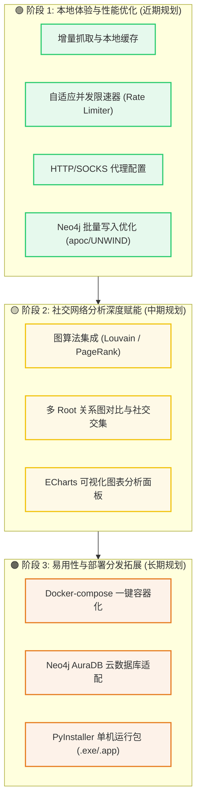

# Steam Friend Relationship Map - Project Roadmap

为了进一步提升工具的实用性、性能及用户体验，本项目制定了以下三阶段的发展路线图。

---

## 1. 路线图概览

---

## 2. 迭代阶段规划详情

### 🟢 阶段 1：本地体验优化与性能强化 (近期规划)
本阶段的核心目标是**优化数据抓取效率，减少等待时间，并提升本地运行的健壮性**。

> [!NOTE]
> 阶段 1 的改动主要集中在底层网络与数据库写入性能，不涉及复杂算法，但能极大提升二次使用的体验。

1. **增量抓取与本地缓存**
   - **内容**：支持对已抓取的节点设置有效期（例如 7 天）。在有效期内，若再次爬取该用户的关联网络，直接读取本地 Neo4j 数据库数据，跳过 Steam API 请求。
   - **收益**：大幅减少 API 额度消耗，二次图谱刷新速度提升 90% 以上。
2. **自适应并发限速器 (Rate Limiter)**
   - **内容**：目前请求为串行延时（通过 Delay ms 保证）。后续引入自适应滑动窗口限速，在维持安全频控的同时，允许安全限额下的异步并发请求。
   - **收益**：缩短多层抓取任务的总耗时。
3. **代理 (Proxy) 配置支持**
   - **内容**：在 Web GUI 安全配置中提供 HTTP/SOCKS 代理输入口，或通过 `.env` 中的 `HTTP_PROXY` / `HTTPS_PROXY` 加载。
   - **收益**：保障国内网络环境可以稳定直接地连通 Steam Web API。
4. **Neo4j 批量写入优化**
   - **内容**：对现有的 `UNWIND` 逻辑进行调优，在导入超大规模节点或关系时优化批处理大小（Batching）。
   - **收益**：降低爬取中后期 Neo4j 本地数据库的写入抖动与 CPU 负载。

---

### 🟡 阶段 2：社交网络分析深度赋能 (中期规划)
本阶段的核心目标是**从单纯的“好友关系罗列”，转变为“深度的圈子聚类与社交网络洞察”**。

> [!TIP]
> 引入图算法和图表分析，可以帮助玩家从数千个好友节点中自动划分出不同的社交小团体，识别出人脉核心。

1. **图算法集成 (Neo4j GDS)**
   - **Louvain / Infomap 社区发现算法**：在前端用不同颜色渲染自动识别出来的“好友圈子”（如：初中同学、大学基友、某游戏群）。
   - **PageRank 或 HITS 算法**：比单纯的“度数（直接好友数）”更科学地计算图谱中的“人脉核心/意见领袖”，在前端提供专门的可视化气泡标识。
2. **多 Root 关系图对比与社交交集**
   - **内容**：允许输入多个 Steam URL 作为 Root 节点，展现多个人之间的共同好友圈以及社交交集。
   - **收益**：方便查看两个陌生或不同朋友圈的用户是如何通过共同好友产生关联的。
3. **高级图表分析面板**
   - **内容**：在右侧面板或新标签页中引入 ECharts 图表，呈现好友列表的统计维度：
     - 好友地理位置/国家分布比例图。
     - 好友游戏库重合度/共同游戏偏好。
     - 好友隐私状态分布比例。

---

### 🟠 阶段 3：易用性与部署分发拓展 (长期规划)
本阶段的核心目标是**简化部署流程，扩大受众群体，让非技术用户也能一键运行**。

> [!WARNING]
> 本阶段属于项目分发与工程化阶段，需要保证各操作系统的兼容性测试。

1. **Docker 容器化一键部署**
   - **内容**：编写 `Dockerfile` 与 `docker-compose.yml`，一键拉起 FastAPI 后端、前端静态服务以及独立的 Neo4j 数据库容器。
   - **收益**：免去用户本地手动安装 and 配置 Neo4j Desktop 的门槛。
2. **云端 Neo4j 支持 (AuraDB)**
   - **内容**：支持 Bolt 协议下的加密远程连接（`neo4j+s://`），测试与 Neo4j AuraDB 云数据库的兼容性。
   - **收益**：支持云端持久化存储，无需在本地运行数据库。
3. **自动打包为桌面单机版应用**
   - **内容**：使用 PyInstaller 打包 Python 后端，并配合轻量级嵌入式壳体（如 Pywebview 或 Electron），打包为 `.exe` (Windows) 和 `.app` (macOS)。
   - **收益**：双击即可运行，完全对普通玩家隐藏命令行操作。

---

## 3. 开发优先级与复杂度矩阵

| 迭代阶段 | 待办特性 | 优先级 | 估算复杂度 | 依赖模块 |
| :--- | :--- | :--- | :--- | :--- |
| **Phase 1** | 代理 (Proxy) 配置支持 | ⭐⭐⭐⭐⭐ | 🟢 简单 (Easy) | `steam.py` |
| **Phase 1** | 增量抓取与本地缓存 | ⭐⭐⭐⭐ | 🟡 中等 (Medium) | `crawler.py`, `neo4j_repo.py` |
| **Phase 1** | 自适应并发限速器 | ⭐⭐⭐ | 🟡 中等 (Medium) | `crawler.py` |
| **Phase 1** | Neo4j 批量写入优化 | ⭐⭐ | 🟡 中等 (Medium) | `neo4j_repo.py` |
| **Phase 2** | 图算法集成 (Louvain/PageRank) | ⭐⭐⭐⭐ | 🔴 困难 (Hard) | `neo4j_repo.py`, `app.js` |
| **Phase 2** | 多 Root 关系对比与交集 | ⭐⭐⭐ | 🟡 中等 (Medium) | `crawler.py`, `app.js` |
| **Phase 2** | ECharts 图表可视化面板 | ⭐⭐ | 🟡 中等 (Medium) | `app.js`, `index.html` |
| **Phase 3** | Docker 容器化一键部署 | ⭐⭐⭐⭐⭐ | 🟢 简单 (Easy) | 部署脚本 |
| **Phase 3** | 云端 Neo4j AuraDB 支持 | ⭐⭐⭐ | 🟢 简单 (Easy) | `settings.py` |
| **Phase 3** | 单机版桌面应用打包 | ⭐⭐ | 🔴 困难 (Hard) | 构建打包工具 |
