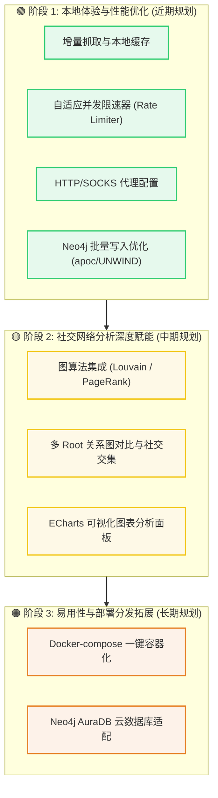
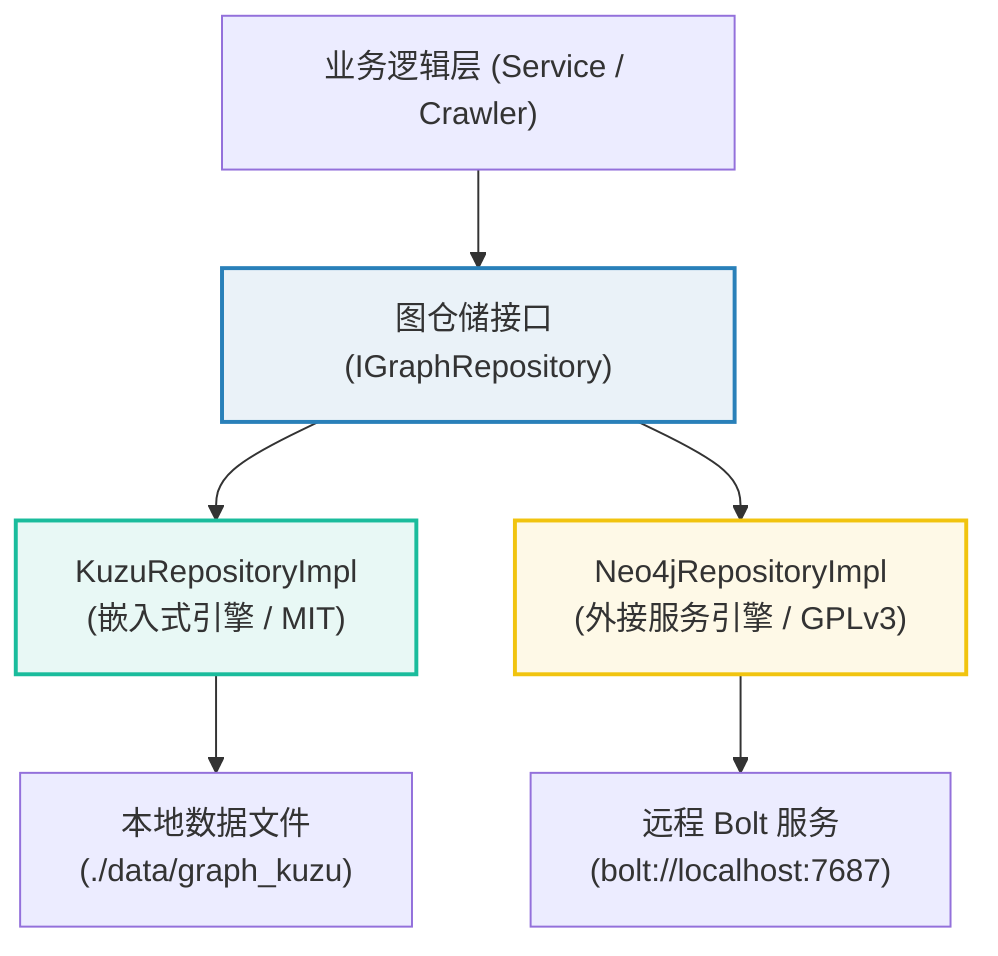

# Steam Friend Relationship Map - Project Roadmap

为了进一步提升工具的实用性、性能及用户体验，本项目制定了以下三阶段的发展路线图。

---

## 1. 路线图概览


```mermaid
graph TD
    classDef p1 fill:#e6f9ed,stroke:#2ecc71,stroke-width:2px;
    classDef p2 fill:#fef9e7,stroke:#f1c40f,stroke-width:2px;
    classDef p3 fill:#fdf2e9,stroke:#e67e22,stroke-width:2px;

    subgraph Phase1["🟢 阶段 1: 本地体验与性能优化 (近期规划)"]
        A["增量抓取与本地缓存"]
        B["自适应并发限速器 (Rate Limiter)"]
        C["HTTP/SOCKS 代理配置"]
        D["Neo4j 批量写入优化 (apoc/UNWIND)"]
    end

    subgraph Phase2["🟡 阶段 2: 社交网络分析深度赋能 (中期规划)"]
        E["图算法集成 (Louvain / PageRank)"]
        F["多 Root 关系图对比与社交交集"]
        G["ECharts 可视化图表分析面板"]
    end

    subgraph Phase3["🟠 阶段 3: 易用性与部署分发拓展 (长期规划)"]
        H["Docker-compose 一键容器化"]
        I["Neo4j AuraDB 云数据库适配"]
    end

    Phase1 --> Phase2
    Phase2 --> Phase3

    class A,B,C,D p1;
    class E,F,G p2;
    class H,I p3;
```

---

## 2. 迭代阶段规划详情

### 🟢 阶段 1：本地体验优化与性能强化 (近期规划)
本阶段的核心目标是**优化数据抓取效率，减少等待时间，并提升本地运行的健壮性**。

> [!NOTE]
> 阶段 1 的改动主要集中在底层网络与数据库写入性能，不涉及复杂算法，但能极大提升二次使用的体验。

1. **增量抓取与本地缓存**
   - **内容**：支持对已抓取的节点设置有效期（例如 7 天）。在有效期内，若再次爬取该用户的关联网络，直接读取本地 Neo4j 数据库数据，跳过 Steam API 请求。
   - **收益**：大幅减少 API 额度消耗，二次图谱刷新速度提升 90% 以上。
2. **自适应并发限速器 (Rate Limiter)**
   - **内容**：目前请求为串行延时（通过 Delay ms 保证）。后续引入自适应滑动窗口限速，在维持安全频控的同时，允许安全限额下的异步并发请求。
   - **收益**：缩短多层抓取任务的总耗时。
3. **代理 (Proxy) 配置支持**
   - **内容**：在 Web GUI 安全配置中提供 HTTP/SOCKS 代理输入口，或通过 `.env` 中的 `HTTP_PROXY` / `HTTPS_PROXY` 加载。
   - **收益**：保障国内网络环境可以稳定直接地连通 Steam Web API。
4. **Neo4j 批量写入优化**
   - **内容**：对现有的 `UNWIND` 逻辑进行调优，在导入超大规模节点或关系时优化批处理大小（Batching）。
   - **收益**：降低爬取中后期 Neo4j 本地数据库的写入抖动与 CPU 负载。

---

### 🟡 阶段 2：社交网络分析深度赋能 (中期规划)
本阶段的核心目标是**从单纯的“好友关系罗列”，转变为“深度的圈子聚类与社交网络洞察”**。

> [!TIP]
> 引入图算法和图表分析，可以帮助玩家从数千个好友节点中自动划分出不同的社交小团体，识别出人脉核心。

1. **图算法集成 (Neo4j GDS)**
   - **Louvain / Infomap 社区发现算法**：在前端用不同颜色渲染自动识别出来的“好友圈子”（如：初中同学、大学基友、某游戏群）。
   - **PageRank 或 HITS 算法**：比单纯的“度数（直接好友数）”更科学地计算图谱中的“人脉核心/意见领袖”，在前端提供专门的可视化气泡标识。
2. **多 Root 关系图对比与社交交集**
   - **内容**：允许输入多个 Steam URL 作为 Root 节点，展现多个人之间的共同好友圈以及社交交集。
   - **收益**：方便查看两个陌生或不同朋友圈的用户是如何通过共同好友产生关联的。
3. **高级图表分析面板**
   - **内容**：在右侧面板或新标签页中引入 ECharts 图表，呈现好友列表的统计维度：
     - 好友地理位置/国家分布比例图。
     - 好友游戏库重合度/共同游戏偏好。
     - 好友隐私状态分布比例。

---

### 🟠 阶段 3：易用性与部署分发拓展 (长期规划)
本阶段的核心目标是**简化部署流程，扩大受众群体，让非技术用户也能一键运行**。

> [!WARNING]
> 本阶段属于项目分发与工程化阶段，需要保证各操作系统的兼容性测试。

1. **Docker 容器化一键部署**
   - **内容**：编写 `Dockerfile` 与 `docker-compose.yml`，一键拉起 FastAPI 后端、前端静态服务以及独立的 Neo4j 数据库容器。
   - **收益**：免去用户本地手动安装 and 配置 Neo4j Desktop 的门槛。
2. **云端 Neo4j 支持 (AuraDB)**
   - **内容**：支持 Bolt 协议下的加密远程连接（`neo4j+s://`），测试与 Neo4j AuraDB 云数据库的兼容性。
   - **收益**：支持云端持久化存储，无需在本地运行数据库。

---

## 3. 开发优先级与复杂度矩阵

| 迭代阶段 | 待办特性 | 优先级 | 估算复杂度 | 依赖模块 |
| :--- | :--- | :--- | :--- | :--- |
| **Phase 1** | 代理 (Proxy) 配置支持 | ⭐⭐⭐⭐⭐ | 🟢 简单 (Easy) | `steam.py` |
| **Phase 1** | 增量抓取与本地缓存 | ⭐⭐⭐⭐ | 🟡 中等 (Medium) | `crawler.py`, `neo4j_repo.py` |
| **Phase 1** | 自适应并发限速器 | ⭐⭐⭐ | 🟡 中等 (Medium) | `crawler.py` |
| **Phase 1** | Neo4j 批量写入优化 | ⭐⭐ | 🟡 中等 (Medium) | `neo4j_repo.py` |
| **Phase 2** | 图算法集成 (Louvain/PageRank) | ⭐⭐⭐⭐ | 🔴 困难 (Hard) | `neo4j_repo.py`, `app.js` |
| **Phase 2** | 多 Root 关系对比与交集 | ⭐⭐⭐ | 🟡 中等 (Medium) | `crawler.py`, `app.js` |
| **Phase 2** | ECharts 图表可视化面板 | ⭐⭐ | 🟡 中等 (Medium) | `app.js`, `index.html` |
| **Phase 3** | Docker 容器化一键部署 | ⭐⭐⭐⭐⭐ | 🟢 简单 (Easy) | 部署脚本 |
| **Phase 3** | 云端 Neo4j AuraDB 支持 | ⭐⭐⭐ | 🟢 简单 (Easy) | `settings.py` |

---

## 4. 图数据库“双引擎”架构重构专项路线图 (从 Neo4j 迁移至 Kùzu 嵌入式)

> [!IMPORTANT]
> **合并与提测准则 (Merge & Testing Rule)**：
> 在当前开发分支 `dev/feat/graph-dual-engine` 上的所有代码改造、接口抽象及功能重构未全部完成，且所有自动化测试（单元测试与集成测试）均未跑通之前，**绝对不能**合并入集成主分支 `dev-base`。

### 4.1 目标与背景 (Goals & Background)

为了降低部署门槛、提供开箱即用的体验，并解决多平台分发以及开源合规的局限，本项目拟引入 Kùzu 作为默认内置的进程内（In-Process）图数据库引擎，同时绝对保留原有的外接 Neo4j 接口与能力。

1. **部署门槛高**：用户必须独立安装 Neo4j 服务或运行 Docker，无法做到“开箱即用”。
2. **多平台局限**：社区版重度依赖 JVM，在不同操作系统（如 Windows 原生环境与 macOS 芯片）下的分发和轻量化打包体验不佳。
3. **合规与开源生态**：Neo4j 的闭源趋势以及社区版的 GPL v3 协议，对部分希望进行商业化或宽松二次开发的开源贡献者存在一定限制。

**重构目标**：
* 引入 **Kùzu** 作为**默认内置图数据库**，实现进程内（In-Process）运行，像 SQLite 一样免安装、跨平台、零依赖。
* **绝对保留原有的外接 Neo4j 接口与能力**。通过配置驱动，用户可自由切回独立部署的 Neo4j 集群。
* 抽象出统一的图数据库中间层，统一接口，降低后续业务开发的维护成本。

---

### 4.2 架构设计与双引擎抽象 (Architecture & Framework)

#### 4.2.1 双引擎抽象层 (Abstraction Layer)

为了解耦业务逻辑层与底层数据库驱动，引入工厂模式（Factory Pattern）与仓储模式（Repository Pattern），业务逻辑层统一通过 [IGraphRepository](file:///Users/jingfu/development/Steam-Friend-Relationship-Map/src/steam_friend_relationship_map/graph_repo.py) 接口与数据库交互。


```mermaid
graph TD
    Service["业务逻辑层 (Service / Crawler)"] --> IGraphRepo["图仓储接口 (IGraphRepository)"]
    IGraphRepo --> KuzuImpl["KuzuRepositoryImpl<br>(嵌入式引擎 / MIT)"]
    IGraphRepo --> Neo4jImpl["Neo4jRepositoryImpl<br>(外接服务引擎 / GPLv3)"]
    KuzuImpl --> LocalData["本地数据文件<br>(./data/graph_kuzu)"]
    Neo4jImpl --> RemoteBolt["远程 Bolt 服务<br>(bolt://localhost:7687)"]

    style IGraphRepo fill:#eaf2f8,stroke:#2980b9,stroke-width:2px;
    style KuzuImpl fill:#e8f8f5,stroke:#1abc9c,stroke-width:2px;
    style Neo4jImpl fill:#fef9e7,stroke:#f1c40f,stroke-width:2px;
```

#### 4.2.2 配置项驱动 (.env / settings.py)

通过环境变量控制底层数据库引擎的加载，使引擎切换对前端和高层业务 API 完全透明。在 [.env](file:///Users/jingfu/development/Steam-Friend-Relationship-Map/.env) 中新增如下配置，并由 [settings.py](file:///Users/jingfu/development/Steam-Friend-Relationship-Map/src/steam_friend_relationship_map/settings.py) 加载：

```ini
# 激活的图数据库引擎类型: 'kuzu' 或 'neo4j'
GRAPH_DB_ENGINE=kuzu

# ==========================================
# 1. Kùzu (嵌入式) 配置
# ==========================================
KUZU_DB_PATH=./data/graph_kuzu
KUZU_BUFFER_POOL_SIZE_GB=1  # 显式限制内存占用

# ==========================================
# 2. Neo4j (原有外接) 配置
# ==========================================
NEO4J_URI=bolt://localhost:7687
NEO4J_USER=neo4j
NEO4J_PASSWORD=my_secure_password
```

---

### 4.3 实施步骤与排班表 (Implementation Steps)

| 阶段 | 核心任务 | 预估工期 | 关键交付物 |
| :--- | :--- | :--- | :--- |
| **阶段一** | 新分支初始化与接口抽象 | 1 天 | 定义统一接口 [IGraphRepository](file:///Users/jingfu/development/Steam-Friend-Relationship-Map/src/steam_friend_relationship_map/graph_repo.py)，归拢原有 Neo4j 代码至 [Neo4jRepositoryImpl](file:///Users/jingfu/development/Steam-Friend-Relationship-Map/src/steam_friend_relationship_map/neo4j_repo.py) |
| **阶段二** | 引入 Kùzu 引擎与 Schema 适配 | 2 天 | 集成 Kùzu 依赖，编写 [KuzuRepositoryImpl](file:///Users/jingfu/development/Steam-Friend-Relationship-Map/src/steam_friend_relationship_map/kuzu_repo.py) 初始化强 Schema 与数据迁移脚本 |
| **阶段三** | Cypher 语法对齐与差异调优 | 2 天 | 参数化查询符号适配，调优深层拓扑遍历语句（如 `-[*1..3]->`）在 Kùzu 的性能 |
| **阶段四** | 多平台交叉验证与 CI/CD 优化 | 1 天 | Windows/macOS/Linux 免安装启动验证，CI/CD 默认采用 Kùzu 运行集成测试 |

#### 4.3.1 阶段一：新分支初始化与接口抽象 (1天)
1. **创建分支**：基于 `dev-base` 创建规范命名分支 `dev/feat/graph-dual-engine`（已建）。
2. **定义统一接口 [IGraphRepository](file:///Users/jingfu/development/Steam-Friend-Relationship-Map/src/steam_friend_relationship_map/graph_repo.py)**：
   在 `src/steam_friend_relationship_map/` 下新建 `graph_repo.py` 抽象出接口定义，业务层如 [app.py](file:///Users/jingfu/development/Steam-Friend-Relationship-Map/src/steam_friend_relationship_map/app.py) 和 [crawler.py](file:///Users/jingfu/development/Steam-Friend-Relationship-Map/src/steam_friend_relationship_map/crawler.py) 不再直接调用具体的数据库 Driver。
   ```python
   class IGraphRepository(ABC):
       @abstractmethod
       def execute_query(self, query: str, parameters: dict = None) -> list:
           """执行原生 Cypher 查询并返回统一格式的列表"""
           pass

       @abstractmethod
       def initialize_schema(self):
           """初始化图结构（节点、边标签及索引）"""
           pass
   ```
3. **Neo4j 代码归拢**：
   将现有的 [neo4j_repo.py](file:///Users/jingfu/development/Steam-Friend-Relationship-Map/src/steam_friend_relationship_map/neo4j_repo.py) 代码原封不动搬进 [Neo4jRepositoryImpl](file:///Users/jingfu/development/Steam-Friend-Relationship-Map/src/steam_friend_relationship_map/neo4j_repo.py) 中并实现 [IGraphRepository](file:///Users/jingfu/development/Steam-Friend-Relationship-Map/src/steam_friend_relationship_map/graph_repo.py) 接口，确保原有业务逻辑（如项目隔离、并发控制）未受破坏。

#### 4.3.2 阶段二：引入 Kùzu 引擎与 Schema 适配 (2天)
Kùzu 是 Schema-first（强 Schema）数据库，需要显式声明节点表（Node Table）和边表（Rel Table）。
1. **添加依赖**：通过 `uv add kuzu` 将依赖添加至项目。
2. **编写 [KuzuRepositoryImpl](file:///Users/jingfu/development/Steam-Friend-Relationship-Map/src/steam_friend_relationship_map/kuzu_repo.py) 初始化逻辑**：
   ```python
   def initialize_schema(self):
       # 示例：创建强 Schema 映射
       self.conn.execute("CREATE NODE TABLE User(id INT64, name STRING, PRIMARY KEY(id))")
       self.conn.execute("CREATE REL TABLE Follows(FROM User TO User)")
   ```
3. **数据迁移适配**：
   利用 Kùzu 的 `COPY FROM` 语法，或在适配层提供从现有的 CSV / JSON 备份中快速导入导出恢复数据的脚本工具。

#### 4.3.3 阶段三：Cypher 语法对齐与差异调优 (2天)
两款数据库都使用 Cypher 语言，但由于底层存储引擎差异，需要处理以下细节：
1. **动态参数调整**：确保传参符号在适配器内部做统一转换（如统一处理 Neo4j 的 `$param` 与 Kùzu 的 `$param`）。
2. **多跳路径查询微调**：验证项目中的深层拓扑遍历语句（如 `-[*1..3]->`），确保在 Kùzu 的列式存储引擎上跑出最优性能。

#### 4.3.4 阶段四：多平台交叉验证与 CI/CD 优化 (1天)
1. **本地多环境验证**：
   * 在 Windows / macOS / Linux 三端不安装任何 Java 和 Neo4j，直接通过 `GRAPH_DB_ENGINE=kuzu` 启动项目，验证图增删改查是否正常。
   * 开启外接 Neo4j，切换配置，验证原 API 依然能够完美连通。
2. **精简 CI/CD**：
   * 在自动化测试流程中，默认使用嵌入式 Kùzu 进行单元测试与集成测试，不再强制依赖 GitHub Actions 中的 Neo4j Service 容器，大幅缩短流水线等待时间。

---

### 4.4 核心对比与选型边界 (User Guidance)

重构完成后，在 `README.md` 中为用户提供以下部署指导：

| 使用场景 | 推荐配置 | 优势 |
| :--- | :--- | :--- |
| **本地开发、个人测试、轻量级部署** | `GRAPH_DB_ENGINE=kuzu` | **免安装**，解压即用，内存开销极低（可控），随应用一起打包启动。 |
| **企业级生产环境、大集群、多节点高可用** | `GRAPH_DB_ENGINE=neo4j` | 完美利用原有生态，支持分布式、大并发写入及高级企业级安全特性。 |

---

### 4.5 潜在风险与应对预案 (Risks & Mitigation)

| 潜在风险 | 风险描述 | 应对预案 / 缓解措施 |
| :--- | :--- | :--- |
| **高级 APOC 函数不兼容** | 部分 Neo4j 高级 APOC 函数在 Kùzu 中不原生支持。 | 在 [KuzuRepositoryImpl](file:///Users/jingfu/development/Steam-Friend-Relationship-Map/src/steam_friend_relationship_map/kuzu_repo.py) 的对应方法内，使用后端 Python 的业务逻辑来补全该部分复杂计算，确保向上层 Service 返回的数据结构与 Neo4j 完全一致。 |
| **本地数据可视化缺失** | Neo4j 拥有内置的浏览器控制台，而 Kùzu 默认不带 GUI 界面。 | 在项目文档中补充 `kuzu-explorer` 的本地一键配置与启动指南，方便开源开发者进行直观 of 图数据调试与 Debug。 |
| **多项目逻辑冲突** | 本项目具有基于 `project_id` 的强数据隔离逻辑。 | 确保 [KuzuRepositoryImpl](file:///Users/jingfu/development/Steam-Friend-Relationship-Map/src/steam_friend_relationship_map/kuzu_repo.py) 在设计 Node Table 和 Rel Table 时将 `project_id` 属性纳入过滤，或在 Kùzu 的 schema 中实现完全等价的逻辑划分。 |

---

## 5. 前端 UI/UX 体验优化专项路线图 (UI/UX Optimization Roadmap)

为了进一步提升页面的操作效率、视觉美感和多分辨率适配性，本项目在开发分支 [dev/feat/ui-optimization](file:///Users/jingfu/development/Steam-Friend-Relationship-Map/) 下规划了以下前端体验调优任务：

### 5.1 侧边栏布局精简与折叠重构 (Sidebar Density & Collapsing)
- **任务目标**：针对左侧侧边栏 [.sidebar](file:///Users/jingfu/development/Steam-Friend-Relationship-Map/src/steam_friend_relationship_map/static/index.html#L13-L323) 中过多的配置面板，进行分类整理或多 Tab 标签页改造，减少小分辨率屏幕下的剧烈垂直滚动。
- **实施计划**：
  1. 将核心扫描参数（Root URL, 层数, 节点数）与辅助参数（扫描前筛选、朋友圈/路径筛选）进行页签化（Tabs）或者手风琴式互斥折叠（Accordion）隔离。
  2. 将偏全局的“项目管理”与“安全配置”移动至顶部标题栏的侧边抽屉（Drawer）或设置弹窗（Modal）中，精简侧边栏常驻空间。

### 5.2 自定义美化滚动条 (Custom Scrollbar Design)
- **任务目标**：替代各浏览器默认的粗大、不美观的系统级滚动条，使页面滚动组件视觉风格与 Steam 经典暗色/阳极氧化铝亮色保持高度统一。
- **实施计划**：
  1. 在 [styles.css](file:///Users/jingfu/development/Steam-Friend-Relationship-Map/src/steam_friend_relationship_map/static/styles.css) 中为 Webkit 引擎和 Firefox 的滚动条属性设计自定义变量与滑块配色。
  2. 实现滚动条在 Hover 状态下加深、Leave 状态下半透明缩窄的现代微交互。

### 5.3 移除局部 px 硬编码，引入弹性单位与流式布局 (Fluid Typography & Relative Units)
- **任务目标**：提升系统在不同显示屏及缩放比例下的可读性，增强多端适配的健壮度。
- **实施计划**：
  1. 全面排查 [styles.css](file:///Users/jingfu/development/Steam-Friend-Relationship-Map/src/steam_friend_relationship_map/static/styles.css) 与 inline 样式，逐步将表单控件大小、文字字号、图标外边距等硬编码像素值改为 `rem` / `em`。
  2. 将固定宽度的面板拖拽机制改进为支持按视口占比（`vw`/百分比）的流式伸缩逻辑，优化 [app.js](file:///Users/jingfu/development/Steam-Friend-Relationship-Map/src/steam_friend_relationship_map/static/app.js) 的拖动计算公式。

